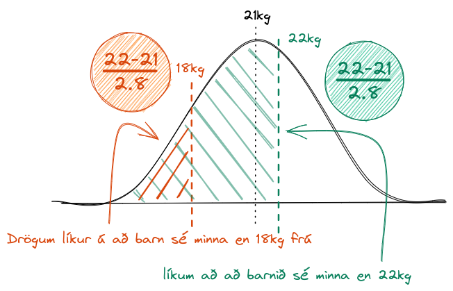

# almennar glósur - tölfræði og gagnavinnsla

## líkur útfrá meðaltali - massafall Poisson dreifingar
> Tryggingasölumaður selur að meðaltali 3 líftryggingar á viku. 
> Hverjar eru líkurnar á að hann selji enga líftryggingu í vikunni

hér notum við massafall Poisson dreifingar, vegna þess að við erum að skoða strjála atburði, fjölda jákvæðra útkoma, þe. fjöldi skipta per ehv
$$P(X=k)=\frac{e^{-\lambda}\cdot\lambda^k}{k!}$$
með gildunum `k=0`,`λ=3` og fáum út úr því 
$$P(X=0)=\frac{e^{-3}\cdot3^0}{0!}=\frac{e^{-3}}{1}=e^{-3}\approx0.05$$

### viðeigandi R-skipun
```R
# dpois(λ, k)
# fyrir þetta dæmi:
val <- dpois(3, 0)
```
> ATH. ef verið að reikna td.
> $P(X\geq 2)$ þá skiptist það niður í   
> $P(X\le 2)=1-(P(X=0)+P(X=1))=1-P(X=0)-P(X=1)$

## líkur útfrá óháðum tilraunum - massafall tvíkostadreifingar
> Við framkvæmum eftirfarandi tilraun fimm sinnum: 
> Drögum spil úr spilastokki, kíkjum á útkomuna, setjum spilið aftur í stokkinn og stokkum. 
> Hverjar eru líkurnar á að rautt spil komi upp tvisvar sinnum?

Látum $X$ tákna fjölda rauðra spila, þe. helming spila, þá er 
$X\approx B(5, 0.5)$ 

> ath B(5, 0.5) táknar mengi tvíkostadrefinguna af 5 og 0.5 þe 
> $\binom{5}{0.5}$ held ég??  
> meira kannski eins og fjöldi mögulegra jákvæðra útkoma yfir fimm tilraunir með helmings líkur

nýtum massafall tvíkostadreifingar
$$P(X=k)=\binom{n}{k}\cdot p^k\cdot(1-p)^{n-k}$$

og reiknum svo 
$P(X=2)$ og fáum
$$P(X=2)=\binom{5}{2}\cdot 0.5^2\cdot 0.5^3=0.3125$$

### viðeigandi R-skipun
```R
# dbinom(n,k,p)
# fyrir þetta dæmi:
val <- dbinom(5,2,0.5
```

<!-- todo: útfæra þessar reglur, úr miðvikudagstímanum -->
X~B(n,p)
P(X=k):  dbinom(k,n,p)
P(X<=k): pbinom(k,n,p)
P(X>k):  1 - pbinom(k,n,p)


X~Pois(λ)
P(X=k):  dpois(k,λ)
P(X<=k): ppois(k,λ)
P(X>k):  1 - ppois(k,λ)

## líkur á stöðu - normaldreifing
Gerum ráð fyrir að meðalhæð kvenna á Íslandi sé normaldreifð með meðaltal 170 cm og staðalfrávik 3 cm. Ef valin er af handahófi íslensk kona, hverjar eru líkurnar á að hún sé lægri en 165 cm á hæð?  
hér er meðaltal 
$\mu = 170cm$ og staðalfrávik 
$\sigma = 3cm$ og finnum staðlað 
$z$ með formúlunni
$$z=\frac{x-\mu}{\sigma} = \frac{165-170}{3} = -1.67$$
við notum síðan töflu normaldreifingarinnar og finnum hvar 
$z=-1.67$ og þá fæst að 
$\Phi (z)=0.0476 \approx 4.8%$

#### viðeigandi R-skipun
```R
# pnorm(x, mu, sigma)
# fyrir þetta dæmi
val <- pnorm(165, 170, 3)
```

## líkur á bili - normaldreifing
Við ætlum að finna líkur á því að þyngd sex ára barna, sem fylgir normaldreifingu með meðaltal 21 og staðalfrávik 2.8, sé á bilinu 18kg til 22kg  
byrjum á að staðla bæði gildi og fáum að
$$18kg = \frac{18-21}{2.8} \approx -1.07$$ 
og 
$$22kg = \frac{22-21}{2.8} \approx 0.36$$

við flettum þessum gildum svo upp í Z-töflu og finnum að
$0.36 -> 0.6406$ og 
$-1.07 -> 0.1423$ við drögum svo neðra bilið frá efra bilinu og fáum lokaniðurstöðuna okkar 
$0.6405 - 0.1423 = 0.4982$


### viðeigandi R-skipun
```R
# pnorm(x2, mu, sigma) - pnorm(x1, mu, sigma)
# fyrir þetta dæmi
val <- pnorm(22, 21, 2.8) - pnorm(18, 21, 2.8)
```

## lágmarksgildi útfrá líkum - normaldreifing
við viljum finna út hvaða lengd ánamaðka, sem er normaldreifð með meðallengd *11cm* og staðalfrávik *1.2cm*, sé nóg til að vera á meðal 40% lengstu ánamaðka  
byrjum á að finna 
$\Phi(1-0.6)$ sem samsvarar topp 40% maðka, flettum því upp í z-töflu og finnum út að z-gildið er 
$0.25$ en þar sem dreifingin upphaflega stöðluð þarf að varpa aftur í upphaflega dreifingu, við gerum það með
$$x=\mu + z\sigma = 11 + 0.25\cdot 1.2 = 11.3$$

### viðeigandi R-skipun
```R
# qnorm(prob, mu, sigma)
# fyrir þetta dæmi
val <- qnorm(0.6,11,1.2)
```

9:      -5/3 = 0.0485
11.5:   5/12 = 0.6591